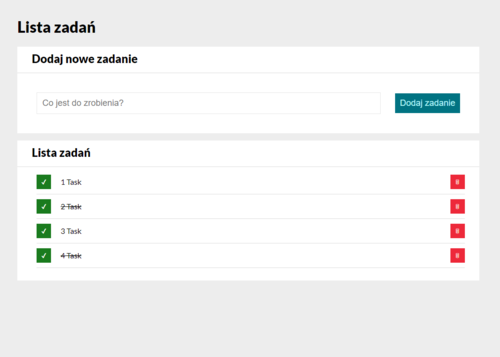

# ALEKSANDER SKUŁA - TO DO LIST

## Table of contents

1. [Description](#description)
1. [Technologies](#technologies)
1. [Demo](#demo)

## Description

This is a small application called "To Do List" based on the [**YouCode - Frontend Developer Course**](https://youcode.pl). It contains basic functionality related to task list management. Tasks can be marked as done, and then deleted or left on the list. Responsiveness is adjusted to PC and mobile devices.

## Technologies
The website is built with use of:

- *HTML5*
- *CSS3*
- *JavaScript with ES6+ features*
- *BEM methodology*

## Demo

(https://olos1992.github.io/To-do-list-2/)